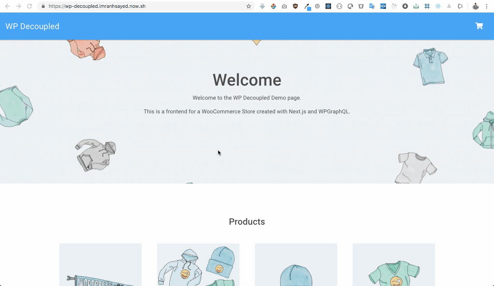

# WP Decoupled :zap:

This is a React theme boilerplate for WordPress, built with Next JS, Webpack, Babel, Node, Express.

## Demo :movie_camera:



## Getting Started :surfer:

These instructions will get you a copy of the project up and running on your local machine for development purposes.


### Installing :wrench:

1. Clone this repo in `git@github.com:rtCamp/wp-decoupled.git`
2. `cd wp-decoupled`
3. `npm install`

## Add GraphQl support on WordPress

1. Clone and activate the following plugins , in your WordPress plugin directory:
	* [wp-graphql](https://github.com/wp-graphql/wp-graphql) Exposes graphql for WordPress
	* [wp-graphiql](https://github.com/wp-graphql/wp-graphiql) Provides GraphiQL IDE (playground) to the WP-Admin
	
2. You can also import default wooCommerce products that come with wooCommerce Plugin for development ( if you don't have any products in your WordPress install )
   WP Dashboard > Tools > WooCommerce products(CSV) : The WooCommerce default products csv file is available at `wp-content/plugins/woocommerce/sample-data/sample_products.csv`   	

## Configure :wrench:

* Rename `client-config-example.js` to `client-config.js` and update your React Site URL

```ruby
const config = {
	siteUrl: 'http://localhost:3000',
	graphqlUrl: 'http://wordpressSiteUrl/graphql'
};
```

* Rename `.env.example` to `.env` and update your WooCommerce config keys

```ruby
WOO_SITE_URL=http://yourwocommercesite.com
WOO_CONSUMER_KEY=xxxxx
WOO_SECRET=xxxxx
```

## Commands :computer:

* `dev` Runs the node server in development mode

## Using PWA on mobile

* Open the site in Chrome on your mobile and then click on add to home screen.
* It will be downloaded and saved as a Progressive Web App on your mobile.
* Once added Look `WP Decoupled` app on your mobile.
* This PWA will work even when you are offline. 

## Branches Information: :seedling:

1. [master](https://github.com/rtCamp/wp-decoupled/tree/master) Main React WooCommerce theme
2. [develop](https://github.com/rtCamp/wp-decoupled/tree/develop) For testing
2. [wp-docoupled-boilerplate](https://github.com/rtCamp/wp-decoupled/tree/wp-decoupled-boilerplate) Boilerplate to start a new React theme project with PWA implementation ( Work in Progress )

## Author

* [rtCamp](https://rtcamp.com)

## Contributor :bust_in_silhouette:

* **[Imran Sayed](https://github.com/imranhsayed)**
* **[Muhammad Muhsin](https://github.com/m-muhsin)**
* **[Divyaraj Masani](https://github.com/divyarajmasani)**
* **[Sayed Taqui](https://github.com/sayedtaqui)**

## License :page_with_curl:

This project is licensed under the MIT License - see the [LICENSE.md](LICENSE.md) file for details
